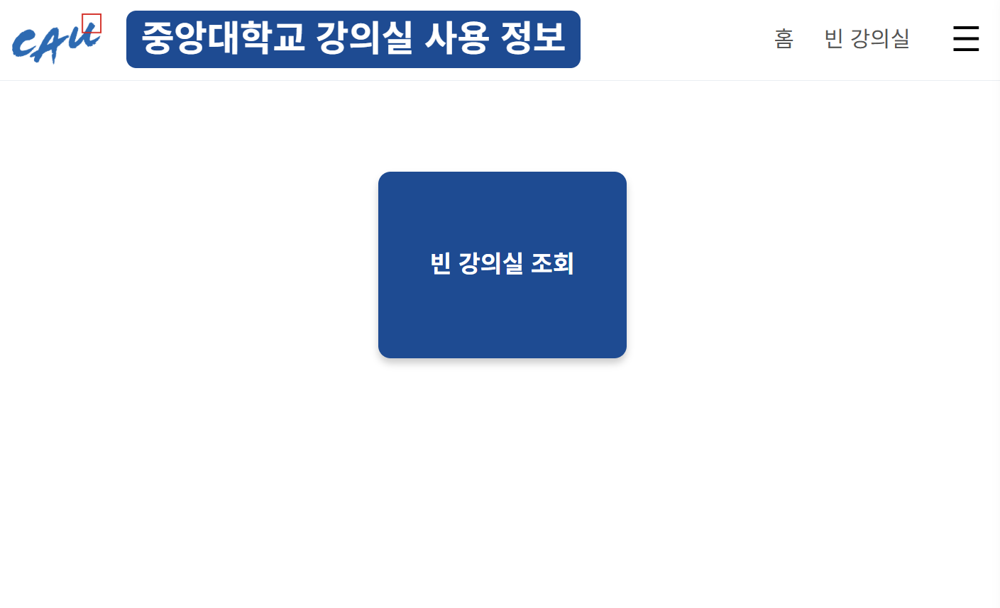
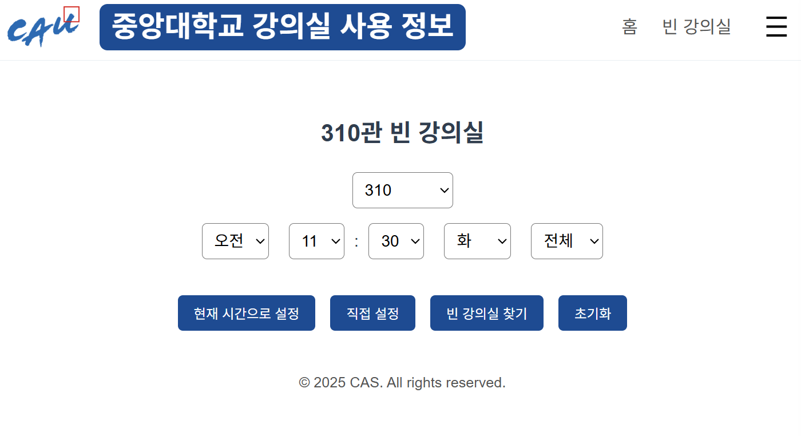
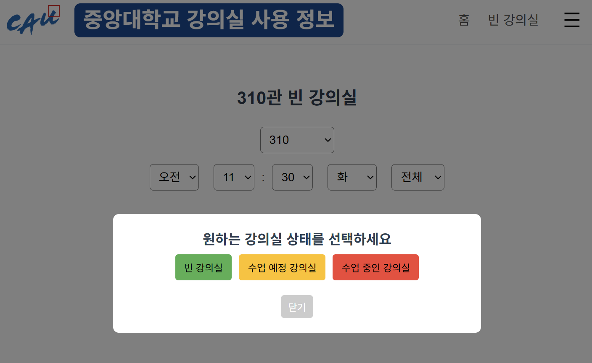
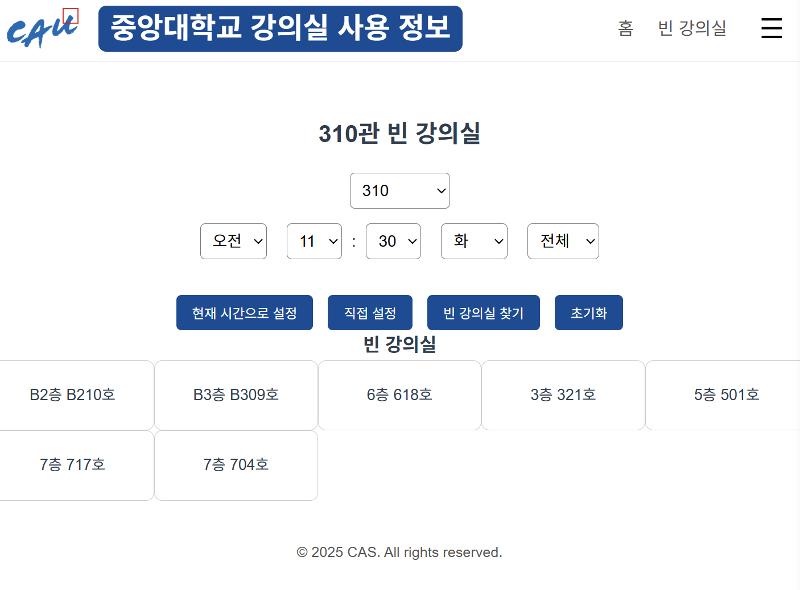

# Vacant Room Backend 🏫

> 중앙대학교 여름방학 CAS 프로젝트 — **빈 강의실 조회 시스템 백엔드**  
> 강의 시간표 데이터를 기반으로, 현재 수업 중인 강의실 / 비어 있는 강의실을 손쉽게 확인할 수 있는 REST API를 제공합니다.  

- [Web](https://vacantroom.vercel.app/)
---

## Introduction

학생들이 공강 시간에 자습하거나 모임 장소를 찾을 때 **“어떤 강의실이 비어 있는지”** 매번 확인하기 번거롭습니다.  
이 프로젝트는 중앙대학교의 시간표 데이터를 수집·정제하여, **실시간으로 빈 강의실을 조회**할 수 있는 API 서버를 구현한 결과물입니다.  

- **FastAPI 기반** 백엔드
- **MongoDB**를 활용한 강의/강의실 데이터 관리
- **CORS 설정**을 통한 프론트엔드(Vue.js, Vercel) 연동
- 피드백 관리 및 Excel export 기능 지원  

---

## Skills

- **Backend**: FastAPI  
- **Database**: MongoDB
- **Frontend 연동**: Vue.js (별도 레포)  
- **Deployment**: Render (백엔드) + Vercel (프론트엔드)  

---
## Repository Structure

```
    Vacant_Room_Backend/
    ├── data/                          # Data preprocessing scripts
    │   ├── excel_to_json.py           # Convert Excel timetable data into JSON format
    │   └── json_to_mongodb.py         # Import JSON data into MongoDB
    │
    ├── db/                            # Database connection layer
    │   └── mongo.py                   # MongoDB client initialization and helpers
    │
    ├── models/                        # Data models (Pydantic schemas)
    │   └── feedback.py                # Schema for user feedback documents
    │
    ├── routes/                        # API route definitions (FastAPI routers)
    │   ├── feedback.py                # Endpoints for submitting and exporting feedback
    │   ├── health.py                  # Health check endpoint (/ping)
    │   ├── rooms.py                   # Core: query vacant rooms & class schedules
    │   └── timetable.py               # Endpoints for retrieving room timetables
    │
    ├── utils/                         # Utility/helper functions
    │   ├── bson_utils.py              # BSON <-> JSON conversion utilities
    │   ├── excel.py                   # Excel export utilities (feedback/timetable)
    │   └── time_utils.py              # Time formatting
    │
    ├── main.py                        # Entry point: initializes FastAPI app & routers
    ├── requirements.txt               # Python dependencies
    ├── .gitignore                     # Git ignore rules
    ├── (.env)                         # Environment variables (MongoDB URI, DB name, etc.)
    ├── README.md                      # Project documentation
    └── LICENSE                        # License & copyright notice
```

---
## API

### 1. 빈 강의실 조회 API (`GET /api/rooms`)
- 입력값: 건물 번호, 요일, 시간, 층수  
- 출력값:  
  - 현재 수업  
  - 다음 수업  
  - 이후 수업 목록  
  - 현재 상태 (사용 중 / 비어 있음...)  

### 2. 시간표 조회 API (`GET /api/timetable`)
- 특정 강의실의 **오늘 전체 시간표**를 반환  

### 3. 피드백 수집 API (`/api/feedback`)
- 사용자 의견 저장 (`POST /api/feedback`)
- 관리자용 Excel 다운로드 지원 (`GET /api/feedback/export`) 

### 4. Health Check (`HEAD or GET /health`)
- 배포 환경에서 정상 동작 확인용  

---

## Example




---

## Team

- Backend: 김동건 (@Goldeast16)  
- Frontend: 김영재 (@howcani6), 윤진규
- 데이터 수집: 지민근  

---

## License
이 프로젝트의 모든 권리는 제작자에게 있으며, **제작자의 사전 동의 없이 이용, 수정, 배포를 금지합니다.**  
Unauthorized use, modification, or distribution of this project is prohibited.
